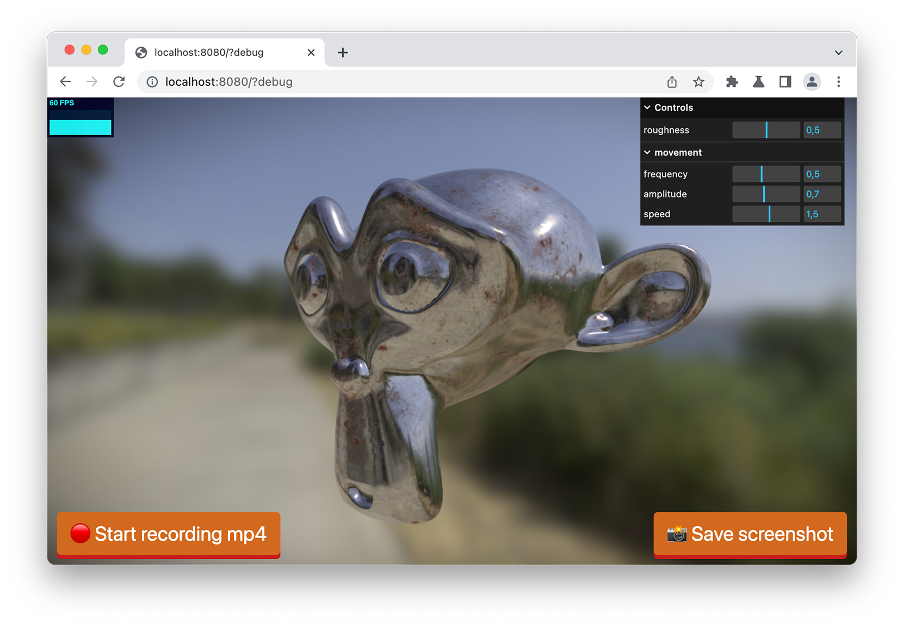
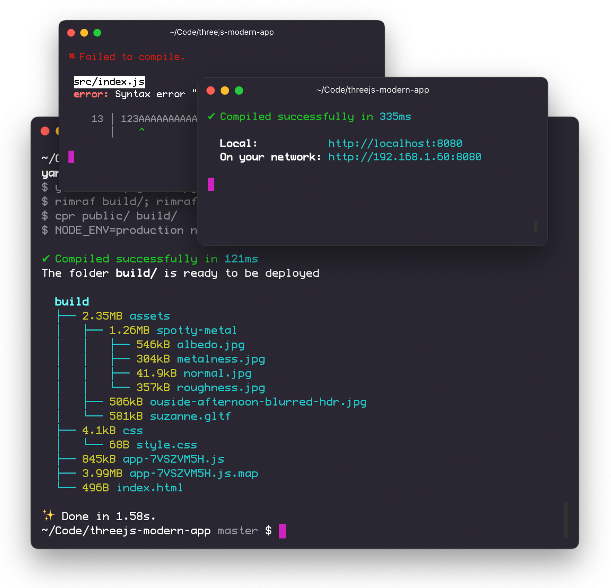

# threejs-modern-app

> Boilerplate and utils for a fullscreen three.js app

[](https://marcofugaro.github.io/threejs-modern-app/?debug)

It is inspired from [mattdesl](https://twitter.com/mattdesl)'s [threejs-app](https://github.com/mattdesl/threejs-app), but it was rewritten and simplified using **ES6** syntax rather than node, making it easier to read and well commented, so it can be easily customized to fit your needs.

### [DEMO](https://marcofugaro.github.io/threejs-modern-app/?debug)

### [Example of production scale project](https://github.com/marcofugaro/shrimpcat/)

### [Yeoman Generator (CLI that generates a blank project without the example code)](https://github.com/marcofugaro/generator-treejs-modern-app)

## Features

- All the **three.js boilerplate code is tucked away** in a file, the exported `WebGLApp` is easily configurable from the outside, for example you can enable [postprocessing](https://github.com/vanruesc/postprocessing), orbit controls, [FPS stats](https://github.com/marcofugaro/stats.js/), [Detect GPU](https://github.com/TimvanScherpenzeel/detect-gpu), a [controls-gui](https://github.com/rreusser/controls-gui) and use the save screenshot or record mp4 functionality. It also has built-in support for [cannon-es](https://github.com/pmndrs/cannon-es). [[Read more](#webglapp)]
- A **scalable three.js component structure** where each component is a class which extends `THREE.Group`, so you can add any object to it. The class also has update, resize, and pointer hooks. [[Read more](#component-structure)]
- An **asset manager** which handles the preloading of `.gltf` models, images, audios, videos and can be easily extended to support other files. It also automatically uploads a texture to the GPU, loads cube env maps or parses equirectangular projection images. [[Read more](#asset-manager)]
- global `window.DEBUG` flag which is true when the url contains `?debug` as a query parameter. So you can enable **debug mode** both locally and in production. [[Read more](#debug-mode)]
- [glslify](https://github.com/glslify/glslify) to import shaders from `node_modules`. [[Read more](#glslify)]
- GPU tiering info using [detect-gpu](https://github.com/TimvanScherpenzeel/detect-gpu) [[Read more](#gpu-info)]
  <!-- - **Hot reload**. [[Read more](#hot-reload)] -->
- Modern and customizable development tools such as ⚡️**esbuild**⚡️, eslint, and prettier.
- Beautiful console output:



## Usage

Once you installed the dependencies running `yarn`, these are the available commands:

- `yarn start` starts a server locally
- `yarn build` builds the project for production, ready to be deployed from the `build/` folder

All the build tools logic is in the `package.json` and `esbuild.mjs`.

## WebGLApp

```js
import WebGLApp from './lib/WebGLApp'

const webgl = new WebGLApp({ ...options })
```

The WebGLApp class contains all the code needed for three.js to run a scene, it is always the same so it makes sense to hide it in a standalone file and don't think about it.

You can see an example configuration here:

https://github.com/marcofugaro/threejs-modern-app/blob/bd303c968c0b0ef56a40046e054371ba4b8c7e54/src/index.js#L14-L45

You can pass the class the options you would pass to the [THREE.WebGLRenderer](https://threejs.org/docs/#api/en/renderers/WebGLRenderer), and also some more options:

| Option                | Default                      | Description                                                                                                                                                                                     |
| --------------------- | ---------------------------- | ----------------------------------------------------------------------------------------------------------------------------------------------------------------------------------------------- |
| `background`          | `'#111'`                     | The background of the scene.                                                                                                                                                                    |
| `backgroundAlpha`     | 1                            | The transparency of the background.                                                                                                                                                             |
| `maxPixelRatio`       | 2                            | You can clamp the pixelRatio. Often the pixelRatio is clamped for performance reasons.                                                                                                          |
| `width`               | `window.innerWidth`          | The canvas width.                                                                                                                                                                               |
| `height`              | `window.innerHeight`         | The canvas height.                                                                                                                                                                              |
| `orthographic`        | false                        | Use an [OrthographicCamera](https://threejs.org/docs/#api/en/cameras/PerspectiveCamera) instead of the default [PerspectiveCamera](https://threejs.org/docs/#api/en/cameras/PerspectiveCamera). |
| `cameraPosition`      | `new THREE.Vector3(0, 0, 4)` | Set the initial camera position. The camera will always look at [0, 0, 0].                                                                                                                      |
| `fov`                 | 45                           | The field of view of the PerspectiveCamera. It is ignored if the option `orthographic` is true.                                                                                                 |
| `frustumSize`         | 3                            | Defines the size of the OrthographicCamera frustum. It is ignored if the option `orthographic` is false.                                                                                        |
| `near`                | 0.01                         | The camera near plane.                                                                                                                                                                          |
| `far`                 | 100                          | The camera far plane.                                                                                                                                                                           |
| `postprocessing`      | false                        | Enable the [postprocessing library](https://github.com/vanruesc/postprocessing). The composer gets exposed as `webgl.composer`.                                                                 |
| `xr`                  | false                        | Enable three.js WebXR mode. The update function now will have a `xrframe` object passed as a third parameter.                                                                                   |
| `gamma`               | false                        | Turn on gamma correction. Remember to turn on gamma corrections also for textures and colors as stated in [this guide](https://www.donmccurdy.com/2020/06/17/color-management-in-threejs/).     |
| `showFps`             | false                        | Show the [stats.js](https://github.com/mrdoob/stats.js/) fps counter.                                                                                                                           |
| `orbitControls`       | undefined                    | Set this to `true` to enable OrbitControls. You can also pass an object of [OrbitControls properties](https://threejs.org/docs/index.html#examples/en/controls/OrbitControls) to set.           |
| `controls`            | undefined                    | Accepts an object with the [controls-gui](https://github.com/rreusser/controls-gui) configuration. Exposed ad `webgl.controls`.                                                                 |
| `hideControls`        | false                        | Set this to `true` to hide the controls-gui panel.                                                                                                                                              |
| `closeControls`       | false                        | Set this to `true` to initialize the controls-gui panel closed.                                                                                                                                 |
| `world`               | undefined                    | Accepts an instance of the [cannon-es](https://github.com/pmndrs/cannon-es) world (`new CANNON.World()`). Exposed as `webgl.world`.                                                             |
| `showWorldWireframes` | false                        | Set this to `true` to show the wireframes of every body in the world. Uses [cannon-es-debugger](https://github.com/pmndrs/cannon-es-debugger).                                                  |

The `webgl` instance will contain all the three.js elements such as `webgl.scene`, `webgl.renderer`, `webgl.camera` or `webgl.canvas`. It also exposes some useful properties and methods:

### webgl.isDragging

Wether or not the user is currently dragging. It is `true` between the `onPointerDown` and `onPointerUp` events.

### webgl.cursor

Set this property to change the cursor style of the canvas. For example you can use it to display the pointer cursor on some objects:

```js
onPointerMove(event, { x, y }) {
  // raycast and get the intersecting mesh
  const intersectingMesh = getIntersectingMesh([x, y], this, this.webgl)

  if (intersectingMesh) {
    this.webgl.cursor = 'pointer'
  } else {
    this.webgl.cursor = null
  }
}
```

### webgl.saveScreenshot({ ...options })

Save a screenshot of the application as a png.

| Option     | Default              | Description                       |
| ---------- | -------------------- | --------------------------------- |
| `width`    | `window.innerWidth`  | The width of the screenshot.      |
| `height`   | `window.innerHeight` | The height of the screenshot.     |
| `fileName` | `'Screenshot'`       | The name the .png file will have. |

### webgl.startRecording({ ...options })

Start the recording of a video using [mp4-wasm](https://github.com/mattdesl/mp4-wasm).

| Option     | Default              | Description                                                                                                                   |
| ---------- | -------------------- | ----------------------------------------------------------------------------------------------------------------------------- |
| `width`    | `window.innerWidth`  | The width of the video.                                                                                                       |
| `height`   | `window.innerHeight` | The height of the video.                                                                                                      |
| `fileName` | `'Recording'`        | The name the .mp4 file will have.                                                                                             |
| ...others  |                      | Other options that you can pass to the `createWebCodecsEncoder()` method of [mp4-wasm](https://github.com/mattdesl/mp4-wasm). |

### webgl.stopRecording()

Stop the recording and download the video.
It returns a promise that is resolved once the processing is done.

### webgl.onUpdate((dt, time) => {})

Subscribe to the update `requestAnimationFrame` without having to create a component. If needed you can later unsubscribe the function with `webgl.offUpdate(function)`.

| Parameter | Description                                                                                  |
| --------- | -------------------------------------------------------------------------------------------- |
| `dt`      | The seconds elapsed from the latest frame, in a 60fps application it's `0.016s` (aka `16ms`) |
| `time`    | The time in seconds elapsed from when the animation loop starts                              |

### webgl.onPointerDown((event, { x, y }) => {})

Subscribe a function to the `pointerdown` event on the canvas without having to create a component. If needed you can later unsubscribe the function with `webgl.offPointerDown(function)`.

| Parameter  | Description                                                                        |
| ---------- | ---------------------------------------------------------------------------------- |
| `event`    | The native event.                                                                  |
| `position` | An object containing the `x` and the `y` position from the top left of the canvas. |

### webgl.onPointerMove((event, { x, y }) => {})

Subscribe a function to the `pointermove` event on the canvas without having to create a component. If needed you can later unsubscribe the function with `webgl.offPointerMove(function)`.

| Parameter  | Description                                                                                                                                                                                       |
| ---------- | ------------------------------------------------------------------------------------------------------------------------------------------------------------------------------------------------- |
| `event`    | The native event.                                                                                                                                                                                 |
| `position` | An object containing the `x` and the `y` position from the top left of the canvas. If the user is dragging, the object contains also the `dragX` and `dragY` distances from the drag start point. |

### webgl.onPointerUp((event, { x, y }) => {})

Subscribe a function to the `pointerup` event on the canvas without having to create a component. If needed you can later unsubscribe the function with `webgl.offPointerUp(function)`.

| Parameter  | Description                                                                                                                                                              |
| ---------- | ------------------------------------------------------------------------------------------------------------------------------------------------------------------------ |
| `event`    | The native event.                                                                                                                                                        |
| `position` | An object containing the `x` and the `y` position from the top left of the canvas. The object contains also the `dragX` and `dragY` distances from the drag start point. |

## Component structure

Rather than writing all of your three.js app in one file instruction after instruction, you can split your app into thhree.js components". This makes it easier to manage the app as it grows. Here is a basic component:

https://github.com/marcofugaro/threejs-modern-app/blob/master/src/scene/Box.js

A three.js component is a class which extends [`THREE.Group`](https://threejs.org/docs/#api/en/objects/Group) (an alias for [`THREE.Object3D`](https://threejs.org/docs/#api/en/core/Object3D)) and subsequently inherits its properties and methods, such as `this.add(someMesh)` or `this.position` or `this.rotation`. [Here is a full list](https://threejs.org/docs/#api/en/core/Object3D).

After having instantiated the class, you can add it directly to the scene.

```js
// attach it to the scene so you can access it in other components
webgl.scene.birds = new Birds(webgl, { count: 1000 })
webgl.scene.add(webgl.scene.birds)
```

And in the component, you can use the options like this.

```js
export default class Birds extends THREE.Group {
  constructor(webgl, options = {}) {
    super(options)
    // these can be used also in other methods
    this.webgl = webgl
    this.options = options

    // destructure and default values like you do in React
    const { count = 10 } = this.options

    // ...
```

The class supports some hooks, which get called once the element is in the scene:

### update(dt, time) {}

Called each frame of the animation loop of the application. Gets called by the main `requestAnimationFrame`.

| Parameter | Description                                                                                   |
| --------- | --------------------------------------------------------------------------------------------- |
| `dt`      | The seconds elapsed from the latest frame, in a 60fps application it's `0.016s` (aka `16ms`). |
| `time`    | The time in seconds elapsed from when the animation loop starts.                              |

### resize({ width, height, pixelRatio }) {}

Called each time the window has been resized.

| Parameter    | Description                                                                                                |
| ------------ | ---------------------------------------------------------------------------------------------------------- |
| `width`      | The window width.                                                                                          |
| `height`     | The window height.                                                                                         |
| `pixelRatio` | The application pixelRatio, it's usually `window.devicePixelRatio` but clamped with `webgl.maxPixelRatio`. |

### onPointerDown(event, { x, y }) {}

Called on the `pointerdown` event on the canvas.

| Parameter  | Description                                                                        |
| ---------- | ---------------------------------------------------------------------------------- |
| `event`    | The native event.                                                                  |
| `position` | An object containing the `x` and the `y` position from the top left of the canvas. |

### onPointerMove(event, { x, y }) {}

Called on the `pointermove` event on the canvas.

| Parameter  | Description                                                                                                                                                                                       |
| ---------- | ------------------------------------------------------------------------------------------------------------------------------------------------------------------------------------------------- |
| `event`    | The native event.                                                                                                                                                                                 |
| `position` | An object containing the `x` and the `y` position from the top left of the canvas. If the user is dragging, the object contains also the `dragX` and `dragY` distances from the drag start point. |

### onPointerUp(event, { x, y }) {}

Called on the `pointerup` event on the canvas.

| Parameter  | Description                                                                                                                                                              |
| ---------- | ------------------------------------------------------------------------------------------------------------------------------------------------------------------------ |
| `event`    | The native event.                                                                                                                                                        |
| `position` | An object containing the `x` and the `y` position from the top left of the canvas. The object contains also the `dragX` and `dragY` distances from the drag start point. |

### Functional Components

If you don't need any of the previous methods, you can use functional components, which are just plain functions with the objective of making code easier to navigate in.

```js
export function addLights(webgl) {
  const directionalLight = new THREE.DirectionalLight(0xffffff, 0.6)
  directionalLight.position.copy(position)
  webgl.scene.add(directionalLight)

  const ambientLight = new THREE.AmbientLight(0xffffff, 0.5)
  webgl.scene.add(ambientLight)
}

// ...

addLights(webgl)
```

## Asset Manager

The Asset Manager handles the preloading of all the assets needed to run the scene, you use it like this:

https://github.com/marcofugaro/threejs-modern-app/blob/bd303c968c0b0ef56a40046e054371ba4b8c7e54/src/scene/Suzanne.js#L15-L46

https://github.com/marcofugaro/threejs-modern-app/blob/bd303c968c0b0ef56a40046e054371ba4b8c7e54/src/index.js#L56

https://github.com/marcofugaro/threejs-modern-app/blob/bd303c968c0b0ef56a40046e054371ba4b8c7e54/src/scene/Suzanne.js#L54

In detail, first you queue the asset you want to preload in the component where you will use it

```js
import assets from '../lib/AssetManager'

const key = assets.queue({
  url: 'assets/model.gltf',
  type: 'gltf',
})
```

Then you import the component in the `index.js` so that code gets executed

```js
import Component from './scene/Component'
```

And then you start the queued assets loading promise, always in the `index.js`

```js
assets.load({ renderer: webgl.renderer }).then(() => {
  // assets loaded! we can show the canvas
})
```

After that, you init the component and use the asset in the component like this

```js
const modelGltf = assets.get(key)
```

These are all the exposed methods:

### assets.queue({ url, type, ...others })

Queue an asset to be downloaded later with [`assets.load()`](#assetsload-renderer-).

| Option    | Default      | Description                                                                                                                                                                                                                                                                                                            |
| --------- | ------------ | ---------------------------------------------------------------------------------------------------------------------------------------------------------------------------------------------------------------------------------------------------------------------------------------------------------------------- |
| `url`     |              | The url of the asset relative to the `public/` folder. Can be an array if `type: 'env-map'` and you're loading a [cube texture](https://github.com/mrdoob/three.js/tree/dev/examples/textures/cube).                                                                                                                   |
| `type`    | autodetected | The type of the asset, can be either `gltf`, `image`, `svg`, `texture`, `env-map`, `json`, `audio` or `video`. If omitted it will be discerned from the asset extension.                                                                                                                                               |
| `pmrem`   | false        | Only if you set `type: 'env-map'`, you can pass `pmrem: true` to use the [PMREMGenerator](https://threejs.org/docs/#api/en/extras/PMREMGenerator) and prefilter for irradiance. This is often used when applying an envMap to an object rather than a scene background.                                                |
| `linear`  | false        | Only if you set `type: 'texture'` or `type: 'env-map'`. By default, the encoding of the texture is set to whatever the `renderer.outputEncoding` is. You can pass `linear: true` to disable this behaviour, useful when loading linear color data such as roughness maps or normal maps in a gamma corrected workflow. |
| ...others |              | Other options that can be assigned to a [Texture](https://threejs.org/docs/index.html#api/en/textures/Texture) when the type is either `env-map` or `texture`.                                                                                                                                                         |

Returns a `key` that later you can use with [`assets.get()`](#assetsgetkey).

### assets.queueStandardMaterial(maps, options)

Utility to queue multiple maps belonging to the same PBR material. They can later be passed directly to the [MeshStandardMaterial](https://threejs.org/docs/#api/en/materials/MeshStandardMaterial).

For example, here is how you load a brick PBR texture:

```js
const bricksKeys = assets.queueStandardMaterial(
  {
    map: `assets/bricks/albedo.jpg`,
    roughnessMap: `assets/bricks/roughness.jpg`,
    metalnessMap: `assets/bricks/metallic.jpg`,
    normalMap: `assets/bricks/normal.jpg`,
    displacementMap: `assets/bricks/height.jpg`,
    aoMap: `assets/bricks/ambientocclusion.jpg`,
  },
  {
    repeat: new THREE.Vector2().setScalar(0.5),
    wrapS: THREE.RepeatWrapping,
    wrapT: THREE.RepeatWrapping,
  }
)
```

As you can see, you can pass as a second argument any property you want to apply to all textures.

If you're using gamma, the textures with color data will be automatically gamma encoded.

| Option    | Default | Description                                                                                                                                                                                                                        |
| --------- | ------- | ---------------------------------------------------------------------------------------------------------------------------------------------------------------------------------------------------------------------------------- |
| `maps`    |         | An object containing urls for any map from the [MeshStandardMaterial](https://threejs.org/docs/#api/en/materials/MeshStandardMaterial) or [MeshPhysicalMaterial](https://threejs.org/docs/#api/en/materials/MeshPhysicalMaterial). |
| `options` |         | Options you can assign to all textures, such as wrapping or repeating. Any other property of the [Texture](https://threejs.org/docs/#api/en/textures/Texture) can be set.                                                          |

Returns a `keys` object that later you can use with [`assets.getStandardMaterial()`](#assetsgetstandardmaterialkeys).

### assets.load({ renderer })

Load all the assets previously queued.

| Option     | Default | Description                                                         |
| ---------- | ------- | ------------------------------------------------------------------- |
| `renderer` |         | The WebGLRenderer of your application, exposed as `webgl.renderer`. |

### assets.loadSingle({ url, type, renderer, ...others })

Load a single asset without having to pass through the queue. Useful if you want to lazy-load some assets after the application has started. Usually the assets that are not needed immediately.

| Option     | Default      | Description                                                                                                                                                                                                                                                                                                            |
| ---------- | ------------ | ---------------------------------------------------------------------------------------------------------------------------------------------------------------------------------------------------------------------------------------------------------------------------------------------------------------------- |
| `renderer` |              | The WebGLRenderer of your application, exposed as `webgl.renderer`.                                                                                                                                                                                                                                                    |
| `url`      |              | The url of the asset relative to the `public/` folder. Can be an array if `type: 'env-map'` and you're loading a [cube texture](https://github.com/mrdoob/three.js/tree/dev/examples/textures/cube).                                                                                                                   |
| `type`     | autodetected | The type of the asset, can be either `gltf`, `image`, `svg`, `texture`, `env-map`, `json`, `audio` or `video`. If omitted it will be discerned from the asset extension.                                                                                                                                               |
| `pmrem`    | false        | Only if you set `type: 'env-map'`, you can pass `pmrem: true` to use the [PMREMGenerator](https://threejs.org/docs/#api/en/extras/PMREMGenerator) and prefilter for irradiance. This is often used when applying an envMap to an object rather than a scene background.                                                |
| `linear`   | false        | Only if you set `type: 'texture'` or `type: 'env-map'`. By default, the encoding of the texture is set to whatever the `renderer.outputEncoding` is. You can pass `linear: true` to disable this behaviour, useful when loading linear color data such as roughness maps or normal maps in a gamma corrected workflow. |
| ...others  |              | Other options that can be assigned to a [Texture](https://threejs.org/docs/index.html#api/en/textures/Texture) when the type is either `env-map` or `texture`.                                                                                                                                                         |

Returns a `key` that later you can use with [`assets.get()`](#assetsgetkey).

### assets.addProgressListener((progress) => {})

Pass a function that gets called each time an assets finishes downloading. The argument `progress` goes from 0 to 1, with 1 being every asset queued has been downloaded.

### assets.get(key)

Retrieve an asset previously loaded with [`assets.queue()`](#assetsqueue-url-type-others-) or [`assets.loadSingle()`](#assetsloadsingle-url-type-renderer-others-).

| Option | Default | Description                                                                                                                                                                              |
| ------ | ------- | ---------------------------------------------------------------------------------------------------------------------------------------------------------------------------------------- |
| `key`  |         | The key returned from [`assets.queue()`](#assetsqueue-url-type-others-) or [`assets.loadSingle()`](#assetsloadsingle-url-type-renderer-others-). It corresponds to the url of the asset. |

### assets.getStandardMaterial(keys)

Retrieve an asset previously queued with [`assets.queueStandardMaterial()`](#assetsqueuestandardmaterialmaps-options).

It returns an object of the loaded textures that can be fed directly into [MeshStandardMaterial](https://threejs.org/docs/#api/en/materials/MeshStandardMaterial) like this:

```js
const textures = assets.getStandardMaterial(keys)
const material = new THREE.MeshStandardMaterial({ ...textures })
```

| Option | Default | Description                                                                                                 |
| ------ | ------- | ----------------------------------------------------------------------------------------------------------- |
| `keys` |         | The keys object returned from [`assets.queueStandardMaterial()`](#assetsqueuestandardmaterialmaps-options). |

## Debug mode

Often you want to show the fps count or debug helpers such as the [SpotLightHelper](https://threejs.org/docs/#api/en/helpers/SpotLightHelper) only when you're developing or debugging.

A really manageable way is to have a global `window.DEBUG` constant which is true only if you append `?debug` to your url, for example `http://localhost:8080/?debug` or even in production like `https://example.com/?debug`.

This is done [here](https://github.com/marcofugaro/threejs-modern-app/blob/bd303c968c0b0ef56a40046e054371ba4b8c7e54/src/index.js#L9) in just one line:

```js
window.DEBUG = window.location.search.includes('debug')
```

You could also add more global constants by just using more query-string parameters, like this `?debug&fps`.

## glslify

[glslify](https://github.com/glslify/glslify) lets you import shader code directly from `node_modules`.

For example, if you run through glslify a string you're using in three's [onBeforeCompile](https://threejs.org/docs/#api/en/materials/Material.onBeforeCompile), you can import [glsl-noise](https://github.com/hughsk/glsl-noise) like this:

```js
import glsl from 'glslify'

// ...

shader.vertexShader = glsl`
  uniform float time;
  uniform float speed;
  uniform float frequency;
  uniform float amplitude;

  #pragma glslify: noise = require('glsl-noise/simplex/3d')

  // the function which defines the displacement
  float displace(vec3 point) {
    return noise(vec3(point.xy * frequency, time * speed)) * amplitude;
  }

  // ...
`
```

💡 **BONUS TIP**: you can have glsl syntax highlighting for inline glsl strings in VSCode with the extension [glsl-literal](https://marketplace.visualstudio.com/items?itemName=boyswan.glsl-literal).

glslify is applied also to files with the `.frag`, `.vert` or `.glsl` extensions. They are imported as plain strings:

```c
// pass.vert
varying vec2 vUv;

void main() {
  vUv = uv;
  gl_Position = projectionMatrix * modelViewMatrix * vec4(position, 1.0);
}
```

```js
// index.js
import passVertexShader from '../shaders/pass.vert'

// ...

const material = new THREE.ShaderMaterial({
  // it's a string
  vertexShader: passVert,

  // ...
})
```

For a list of shaders you can import via glslify check out [stack.gl packages list](http://stack.gl/packages/).

## GPU Info

Sometimes it might be useful to enable expensive application configuration only on higher-end devices.

This can be done by detecting the user's GPU and checking in which tier it belongs to based on its benchmark score.

This is done thanks to [detect-gpu](https://github.com/TimvanScherpenzeel/detect-gpu), more detailed info about these mechanics in its README.

For example, here is how to enable shadows only on high-tier devices:

```js
if (webgl.gpu.tier > 1) {
  webgl.renderer.shadowMap.enabled = true

  // soft shadows
  webgl.renderer.shadowMap.type = THREE.PCFSoftShadowMap
}
```

Here is what the exposed `webgl.gpu` object contains:

| Key        | Example Value                | Description                                                                                                                   |
| ---------- | ---------------------------- | ----------------------------------------------------------------------------------------------------------------------------- |
| `tier`     | `1`                          | The tier the GPU belongs to. It is incremental, so the higher the better. It goes from 0 to 3. Most GPUs belong to the Tier 2 |
| `isMobile` | `false`                      | Wheter it is a mobile/tablet GPU, or a desktop GPU.                                                                           |
| `name`     | `'intel iris graphics 6100'` | The string name of the GPU.                                                                                                   |
| `fps`      | `21`                         | The specific rank value of the GPU.                                                                                           |

⚠️ **WARNING**: `webgl.gpu` is set asyncronously since the benchmark data needs to be fetched. You might want to wait for the exposed promise `webgl.loadGPUTier`.

More info on this approach also in [this great talk](http://www.youtube.com/watch?v=iNMD8Vr1tKg&t=32m4s) by [luruke](https://github.com/luruke)

## Hot reload

TODO

(find some use cases, maybe only the hot shader reload?)

Take a look at:
https://github.com/mattdesl/canvas-sketch/blob/1cefbcdf2c5302e74a6a84ff803ddbb377e473f5/docs/hot-reloading.md
https://github.com/mattdesl/shader-reload
